<h2>Definición de tablas - Desafío evaluado</h2>

Uso de pdAdmin4 para crear una <a href='[.DE-Peliculas.sql](https://github.com/PauliPuli/DE-Peliculas/blob/main/DE-Peliculas.sql)'>base de datos</a> importando archivos excel.csv que contiene 100 títulos de películas y otro con el reparto de cada una.

<ol>
<li>Crear una base de datos llamada películas</li>
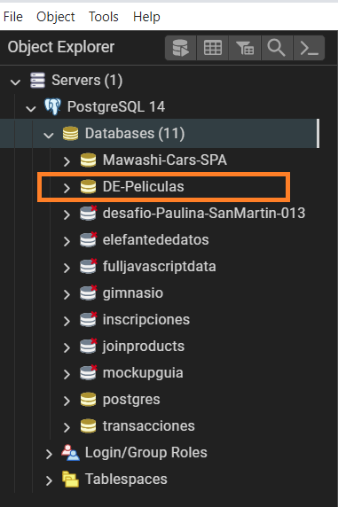
<figcaption>*Para crear la base de datos llamada DE-Peliculas hice click derecho en la pestaña Databases> Create database. También es posible con Query Tool y en la ventana escribir "CREATE DATABASE DE-Peliculas"</figcaption>

<li>Cargar ambos archivos a su tabla correspondiente.</li>

En la tabla "peliculas" el id es el elemento que contiene a la primary key (pelicula_id). Como el programa no permite escribir "año" denominé la columna como "estreno" 

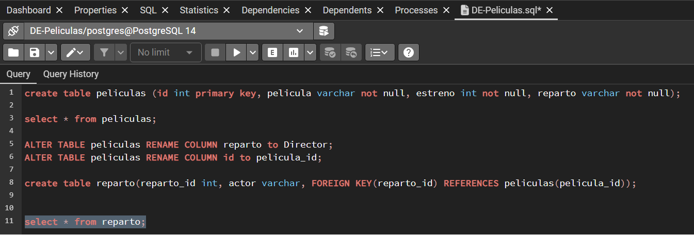
<figcaption>* Al crear la primera tabla escribí "reparto" en vez de "Director" y a la columna id la cambié por pelicula_id, ya que el programa lo marcaba como si tratase de una palabra reservada </figcaption>
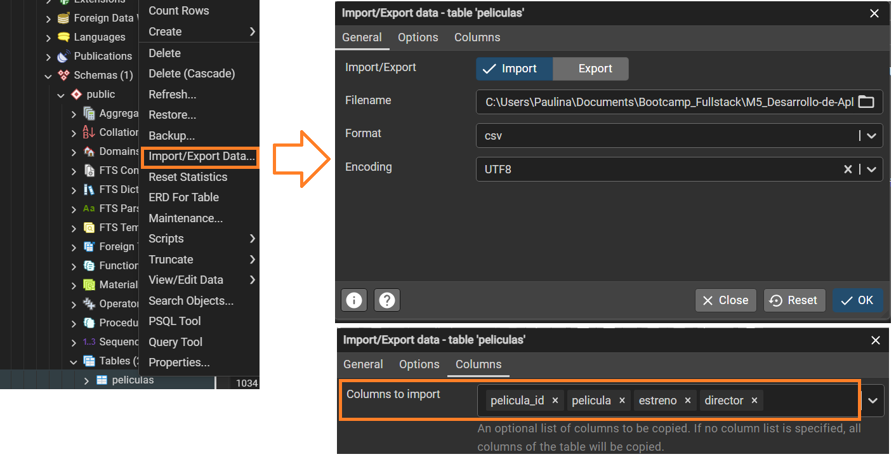
<figcaption>En la pestaña de Columns muestra el nombre de las columnas de la tabla "peliculas".</figcaption>
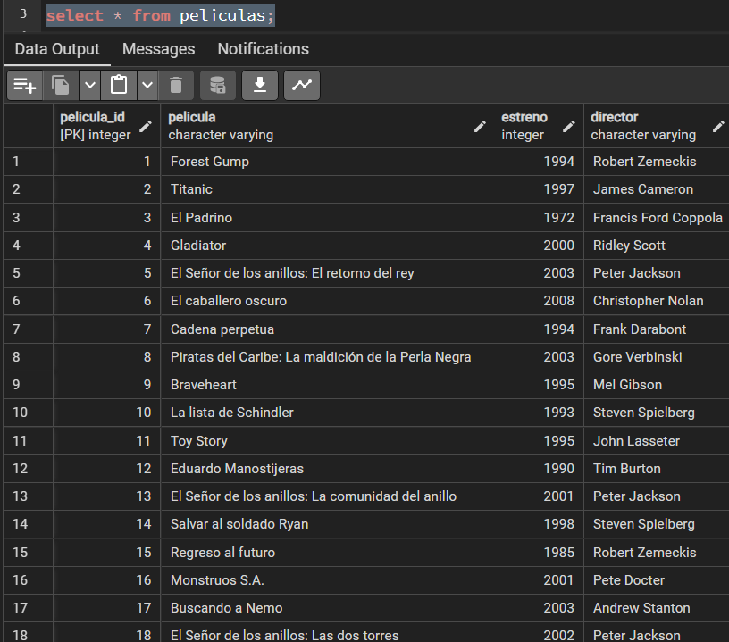
<figcaption>*Los datos fueron importados adecuadamente desde el archivo peliculas.csv. Son 100 filas.</figcaption>
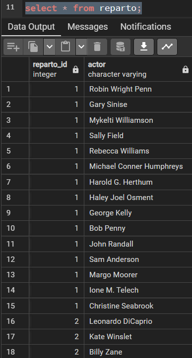
<figcaption>Los datos fueron importados adecuadamente desde el archivo reparto.csv. Son 1050 filas en total</figcaption>

<li>Obtener el ID de la película “Titanic”</li>

En este caso como queremos visualizar el id de la película, sólo llamamos a las columna "pelicula_id" y "película":

select pelicula_id, pelicula from peliculas where pelicula='Titanic';

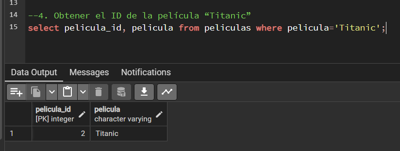
  

<li>Listar a todos los actores que aparecen en la película "Titanic".</li>
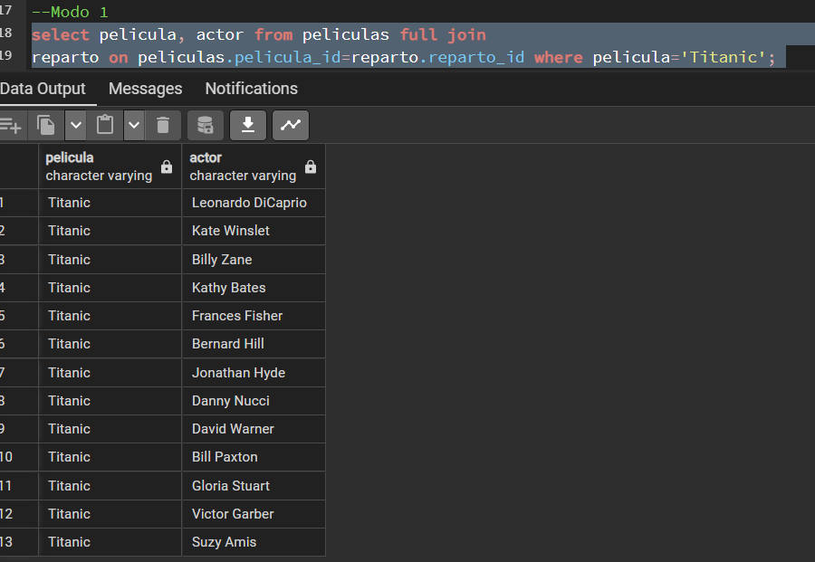

Modo 1: En este caso lo primero que solicité a la tabla fue que seleccionara la columna actor y película de la tabla Película uniendola al reparto_id de la tabla Reparto

 
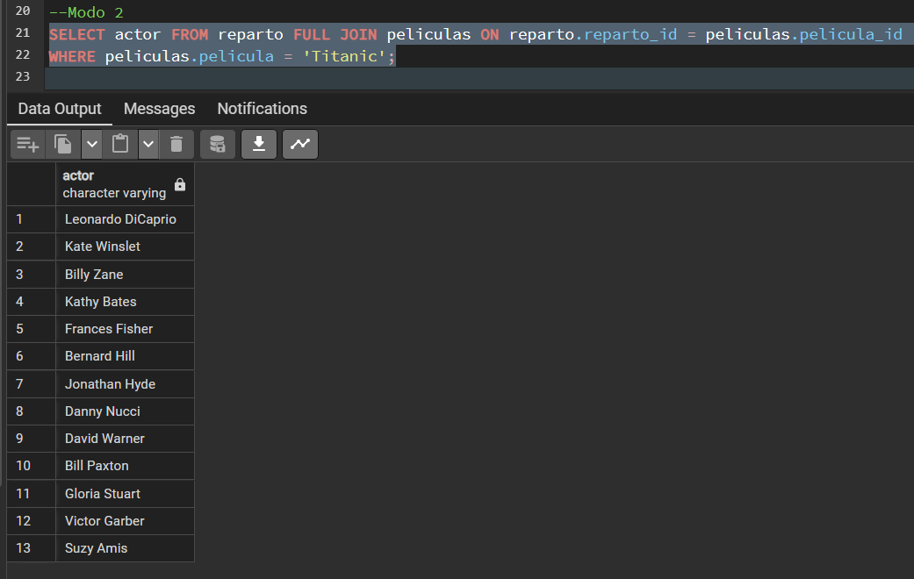

Modo 2: Como el requerimiento sólo pide el reparto de la película, sólo seleccionamos la columna 'actor' de la tabla reparto en la unimos con la tabla 'películas' por su id

<li>Consultar en cuántas películas del top 100 participa Harrison Ford</li>

Harrison Ford ha participado en 8 películas del Top 100

Modo 1: Puedes visualizar las películas en las que ha participado. Aparecen 8 títulos.
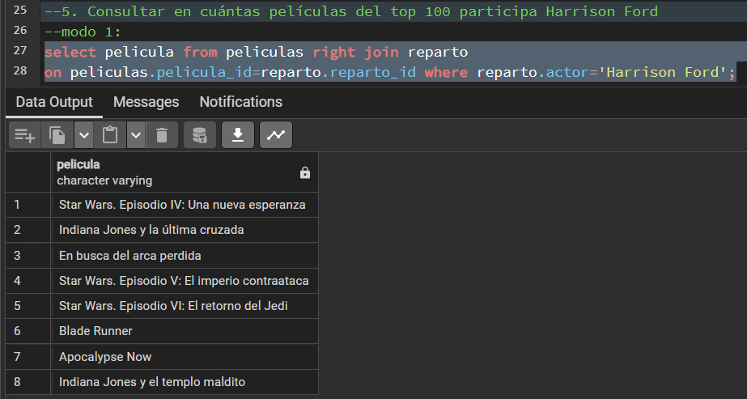
 

Modo 2: Agregando COUNT a la ecuación podemos conocer el número exacto de películas en las que ha participado, sin mostrar los títulos

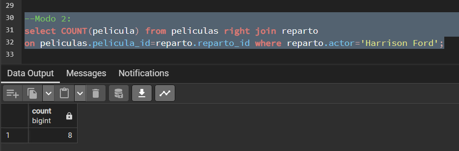

<li>Indicar las películas estrenadas entre los años 1990 y 1999 ordenadas por título de manera ascendente</li>
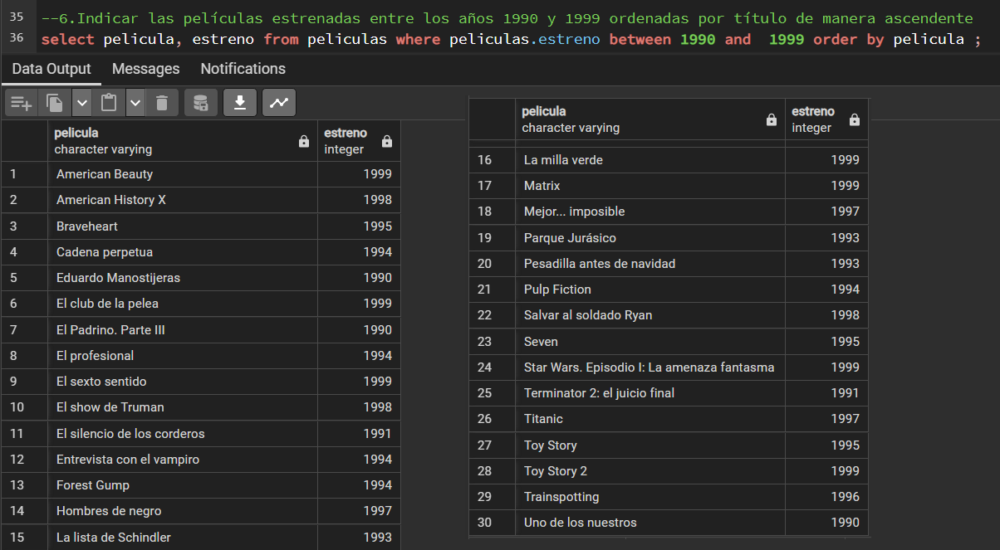

<li> Hacer una consulta SQL que muestre los títulos con su longitud, la longitud debe ser nombrado para la consulta como “longitud_titulo”.</li>
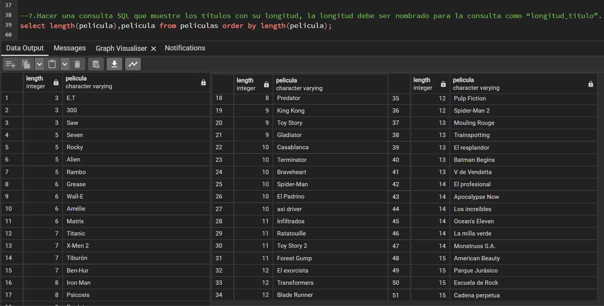
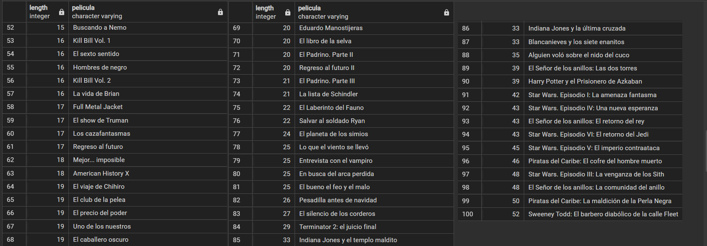

<li>Consultar cual es la longitud más grande entre todos los títulos de las películas</li>

El título con la longitud más larga es "Sweeney Todd: El barbero diabólico de la calle Fleet" con una longitud de 52 caracteres

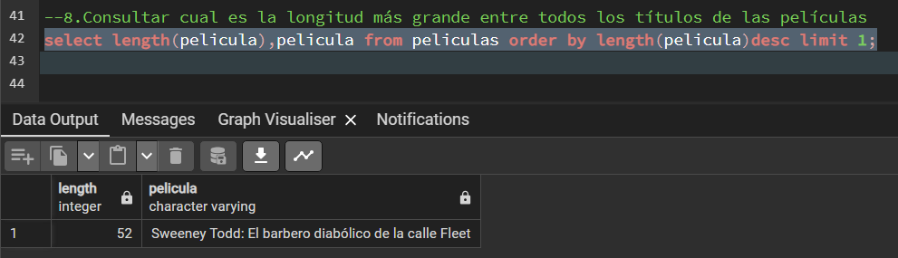
</ol>
